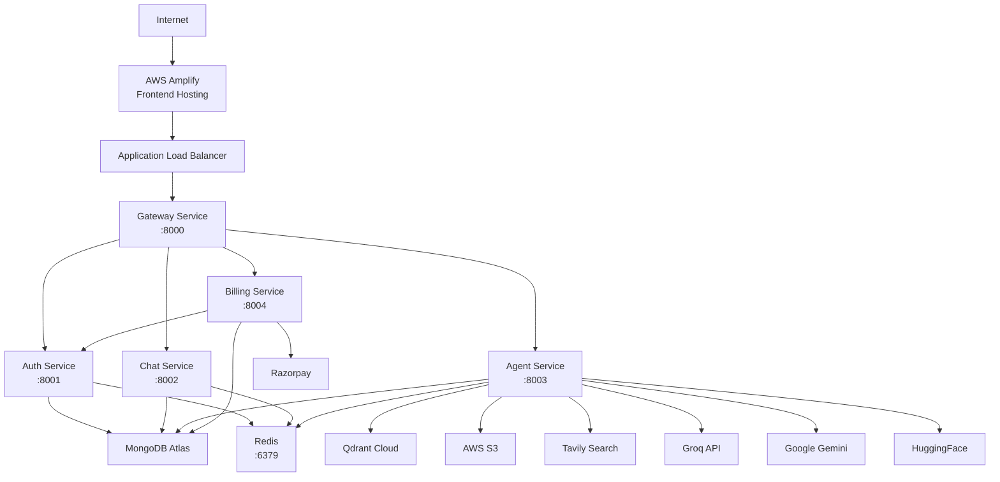
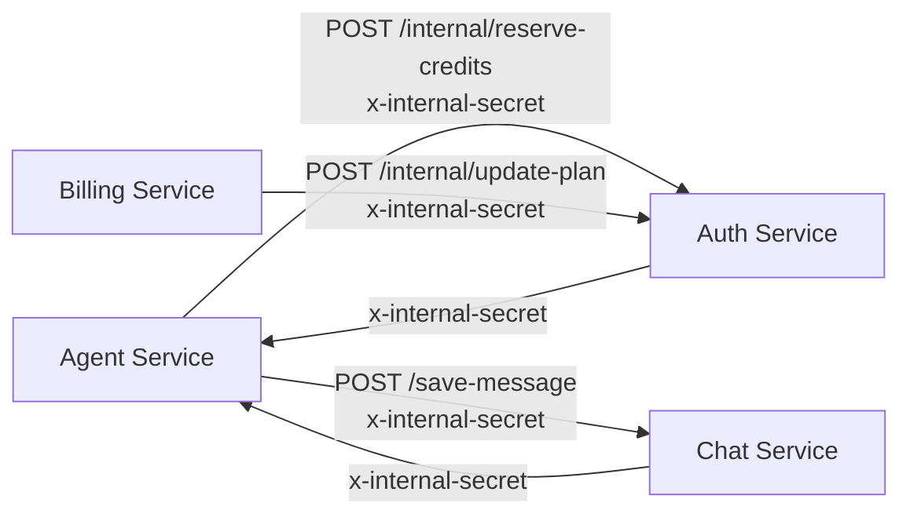
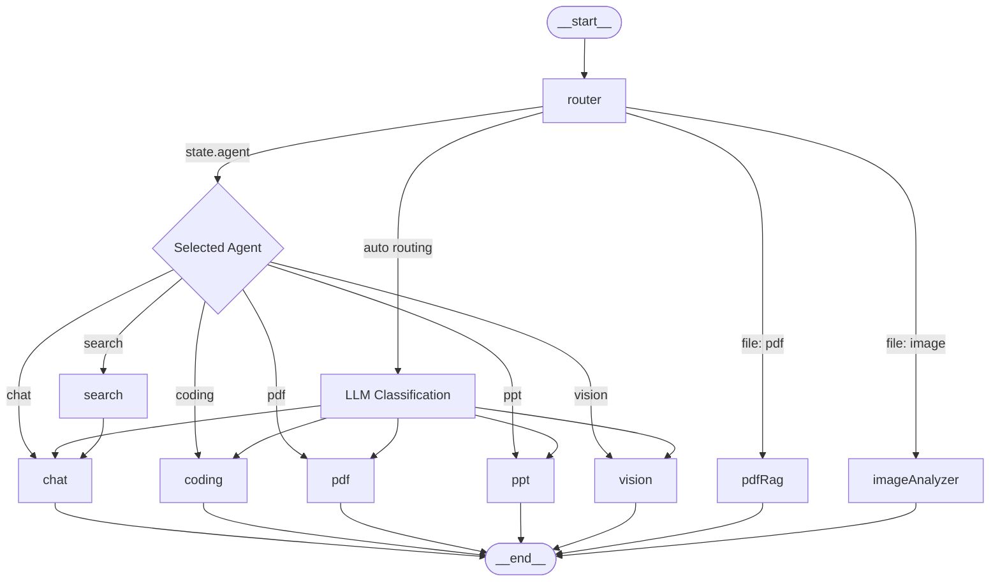
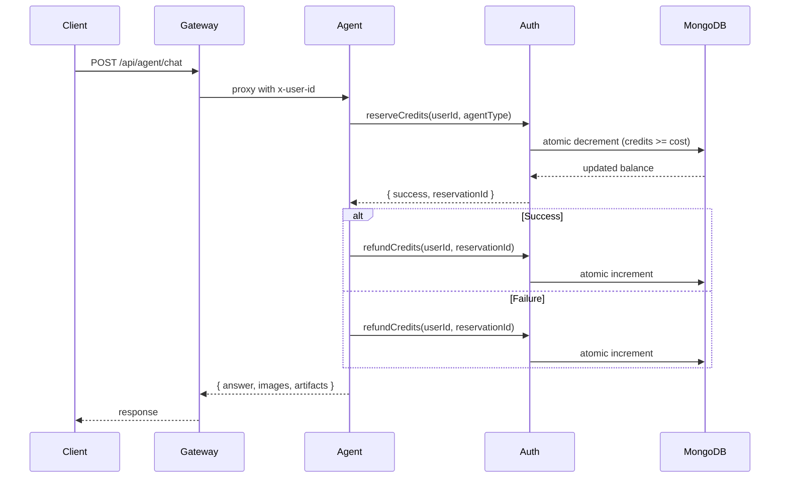
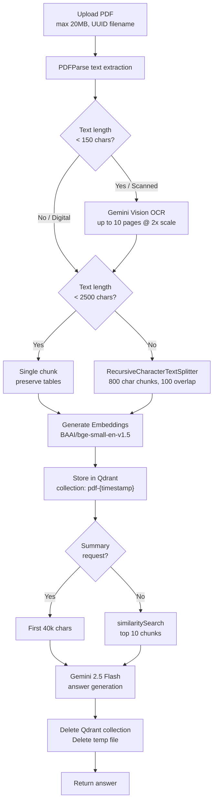
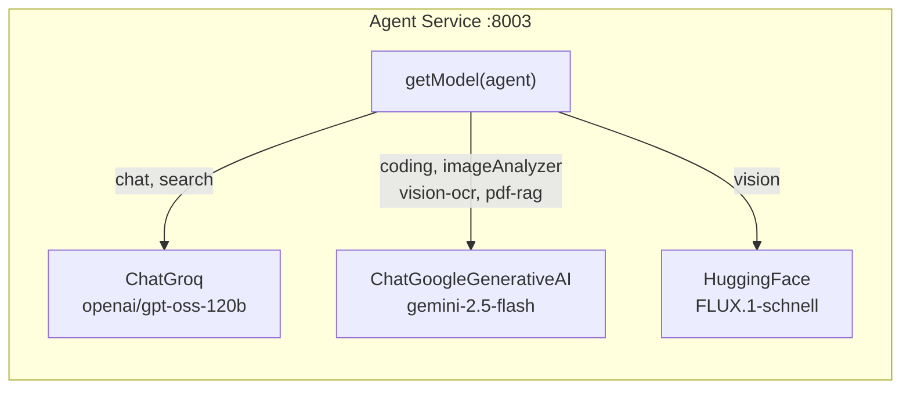
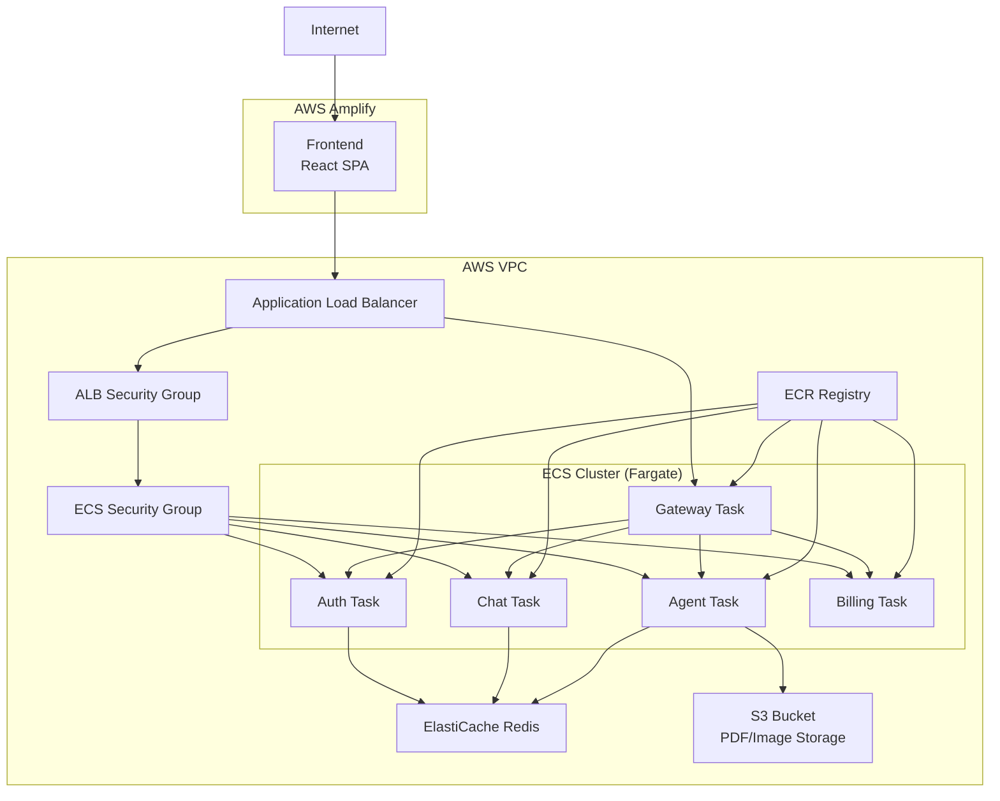

# CortexAI

Production AI-native productivity platform with LangGraph multi-agent orchestration, adaptive PDF RAG pipeline, and credit-based billing.

## Architecture



## Tech Stack

| Layer | Technology |
|-------|------------|
| **Frontend** | React 19.2.8 · Vite 8.2.2 · Redux Toolkit 2.12.0 · Tailwind CSS 4.3.3 |
| **Orchestration** | LangGraph (`StateGraph`) |
| **Agents** | Groq (`openai/gpt-oss-120b`) · Gemini (`gemini-2.5-flash`) · HuggingFace |
| **Vector DB** | Qdrant Cloud |
| **Embeddings** | HuggingFace (`BAAI/bge-small-en-v1.5`) |
| **Databases** | MongoDB Atlas · Redis 7.4 (ioredis) |
| **Auth** | Firebase Admin · Session cookies |
| **Payments** | Razorpay |
| **File Storage** | AWS S3 (presigned URLs) |
| **Search** | Tavily |
| **CI/CD** | GitHub Actions · AWS ECS Fargate · ECR · AWS Amplify |
| **CDN** | AWS Amplify |

## Backend Services

| Service | Port | Responsibility | Dependencies |
|---------|------|----------------|--------------|
| **Gateway** | 8000 | Public API entry point, authentication, request proxying | Redis |
| **Auth** | 8001 | Identity, sessions, credit ledger, Firebase validation | MongoDB, Redis |
| **Chat** | 8002 | Conversation/messages persistence, cursor pagination | MongoDB, Redis |
| **Agent** | 8003 | LangGraph orchestration, AI agents, PDF RAG | MongoDB, Redis, Qdrant, S3 |
| **Billing** | 8004 | Razorpay payment integration | MongoDB, Auth service |

### Gateway Routes

| Route | Auth | Target | Purpose |
|-------|------|--------|---------|
| `POST /api/auth/login` | None | Auth | Firebase ID token verification, session cookie issuance |
| `POST /api/auth/logout` | None | Auth | Clear session cookie and Redis keys |
| `POST /api/chat/*` | Session | Chat | Proxied with `x-user-id` header |
| `POST /api/agent/*` | Session | Agent | Proxied with `x-user-id` header |
| `POST /api/billing/*` | Session | Billing | Proxied with `x-user-id` header |
| `GET /api/me` | Session | - | Returns current user from session |

### Internal Service Communication



Services communicate via HTTP with `x-internal-secret` header validation (`requireInternal` middleware).

## LangGraph Agent Architecture

### State Schema

| Field | Type | Purpose |
|-------|------|---------|
| `prompt` | string | User input |
| `aiResponse` | string | Final response |
| `agent` | string | Selected agent type |
| `conversationId` | string | Session identifier |
| `searchResults` | array | Tavily results |
| `images` | array | Search result images |
| `artifacts` | array | Generated files |
| `userId` | string | User identifier |
| `file` | object | Uploaded file (PDF/image) |
| `creditsPreReserved` | boolean | Flag for search->chat flow |
| `preReservedAgent` | string | Pre-reserved agent type |
| `preReservationId` | string | Reservation for refund tracking |
| `searchFailed` | boolean | Search failure flag |

### Graph Structure



### Agent Routing Logic

1. If `state.agent` is explicitly set (not "auto"), use that agent
2. If file attached:
   - `application/pdf` -> `pdfRag`
   - `image/*` -> `imageAnalyzer`
3. Otherwise, LLM-based intent classification via Groq router

### Agent Model Assignment

| Agent | Provider | Model |
|-------|----------|-------|
| chat | Groq | `openai/gpt-oss-120b` |
| search | Groq | `openai/gpt-oss-120b` |
| coding | Gemini | `gemini-2.5-flash` |
| pdf | Groq (default) | - |
| ppt | Groq (default) | - |
| vision | HuggingFace | `FLUX.1-schnell` |
| pdfRag | Gemini | `gemini-2.5-flash` |
| imageAnalyzer | Gemini | `gemini-2.5-flash` |
| vision-ocr | Gemini | `gemini-2.5-flash` |

**Note:** OpenRouter is installed (`@langchain/openrouter`) but not actively used. No automatic provider fallback exists.

### Credit Reservation Flow



## Adaptive PDF RAG Pipeline



**Libraries:**
- `pdf-parse` for text extraction
- `pdfjs-dist` bundled for page screenshots (vision OCR)
- `@langchain/textsplitters` for chunking

## AI Provider Routing



Provider selection is hardcoded per agent via `getModel()` factory. No runtime fallback exists.

## CI/CD Pipeline

### GitHub Actions Workflow

```mermaid
graph TB
    PUSH["Push to main<br/>branch"]
    CHECKOUT["Checkout code"]
    AWS_CREDS["Configure AWS<br/>credentials"]
    ECR_LOGIN["Login to ECR"]
    BUILD_GW["Build Gateway<br/>docker build"]
    BUILD_AUTH["Build Auth<br/>docker build"]
    BUILD_CHAT["Build Chat<br/>docker build"]
    BUILD_AGENT["Build Agent<br/>docker build"]
    BUILD_BILL["Build Billing<br/>docker build"]
    PUSH_GW["Push gateway<br/>latest"]
    PUSH_AUTH["Push auth-service<br/>latest"]
    PUSH_CHAT["Push chat-service<br/>latest"]
    PUSH_AGENT["Push agent-service<br/>latest"]
    PUSH_BILL["Push billing-service<br/>latest"]
    DEPLOY_GW["Deploy Gateway<br/>ECS force-new-deployment"]
    DEPLOY_AUTH["Deploy Auth<br/>ECS force-new-deployment"]
    DEPLOY_CHAT["Deploy Chat<br/>ECS force-new-deployment"]
    DEPLOY_AGENT["Deploy Agent<br/>ECS force-new-deployment"]
    DEPLOY_BILL["Deploy Billing<br/>ECS force-new-deployment"]

    PUSH --> CHECKOUT
    CHECKOUT --> AWS_CREDS
    AWS_CREDS --> ECR_LOGIN
    ECR_LOGIN --> BUILD_GW
    BUILD_GW --> PUSH_GW
    PUSH_GW --> BUILD_AUTH
    BUILD_AUTH --> PUSH_AUTH
    PUSH_AUTH --> BUILD_CHAT
    BUILD_CHAT --> PUSH_CHAT
    PUSH_CHAT --> BUILD_AGENT
    BUILD_AGENT --> PUSH_AGENT
    PUSH_AGENT --> BUILD_BILL
    BUILD_BILL --> PUSH_BILL
    PUSH_BILL --> DEPLOY_GW
    DEPLOY_GW --> DEPLOY_AUTH
    DEPLOY_AUTH --> DEPLOY_CHAT
    DEPLOY_CHAT --> DEPLOY_AGENT
    DEPLOY_AGENT --> DEPLOY_BILL
```



### ECS Deployment Topology



**Workflow details:**
- Trigger: Push to `main` branch
- Tag strategy: `latest` only (no commit SHA)
- Deployment: `aws ecs update-service --force-new-deployment` (no stability wait)
- Amplify frontend: Managed separately via Amplify console

**Required GitHub Secrets:**
```
AWS_REGION, AWS_ACCOUNT_ID, AWS_ACCESS_KEY, AWS_SECRET_ACCESS_KEY
ECS_CLUSTER, GATEWAY_SERVICE, AUTH_SERVICE, CHAT_SERVICE, AGENT_SERVICE, BILLING_SERVICE
```

## Local Development

### Start Redis
```bash
cd backend && docker compose up -d redis
```

### Start Backend Services
```bash
cd backend/gateway && node index.js          # :8000
cd backend/services/auth && node index.js    # :8001
cd backend/services/chat && node index.js     # :8002
cd backend/services/agent && node index.js    # :8003
cd backend/services/billing && node index.js  # :8004
```

### Start Frontend
```bash
cd frontend && npm install && npm run dev    # :5173
```

## Environment Variables

### Gateway (`backend/gateway/.env`)
| Variable | Description |
|----------|-------------|
| `PORT` | Service port (8000) |
| `AUTH_SERVICE` | Auth service URL |
| `CHAT_SERVICE` | Chat service URL |
| `AGENT_SERVICE` | Agent service URL |
| `BILLING_SERVICE` | Billing service URL |
| `FRONTEND_URL` | Frontend URL for CORS |
| `REDIS_URL` | Redis connection URL |
| `INTERNAL_API_SECRET` | Shared secret for service-to-service auth |

### Auth Service (`backend/services/auth/.env`)
| Variable | Description |
|----------|-------------|
| `PORT` | Service port (8001) |
| `MONGODB_URI` | MongoDB connection string |
| `REDIS_URL` | Redis connection URL |
| `INTERNAL_API_SECRET` | Shared secret |
| `COOKIE_SECURE` | Secure cookie flag (false for local dev) |
| `COOKIE_SAMESITE` | SameSite attribute (lax) |

### Chat Service (`backend/services/chat/.env`)
| Variable | Description |
|----------|-------------|
| `PORT` | Service port (8002) |
| `MONGODB_URI` | MongoDB connection string |
| `REDIS_URL` | Redis connection URL |
| `INTERNAL_API_SECRET` | Shared secret |

### Agent Service (`backend/services/agent/.env`)
| Variable | Description |
|----------|-------------|
| `PORT` | Service port (8003) |
| `MONGODB_URI` | MongoDB connection string |
| `REDIS_URL` | Redis connection URL |
| `INTERNAL_API_SECRET` | Shared secret |
| `CHAT_SERVICE` | Chat service URL |
| `AUTH_SERVICE` | Auth service URL |
| `GROQ_API_KEY` | Groq API key |
| `GOOGLE_API_KEY` | Gemini API key |
| `OPENROUTER_API_KEY` | OpenRouter API key (unused) |
| `TAVILY_API_KEY` | Tavily search API key |
| `HF_TOKEN` | HuggingFace token |
| `HUGGINGFACEHUB_API_KEY` | HuggingFace API key (embeddings) |
| `QDRANT_URL` | Qdrant server URL |
| `QDRANT_API_KEY` | Qdrant API key |
| `AWS_REGION` | AWS region |
| `AWS_ACCESS_KEY_ID` | AWS access key |
| `AWS_SECRET_KEY` | AWS secret key |
| `AWS_BUCKET_NAME` | S3 bucket name |

### Billing Service (`backend/services/billing/.env`)
| Variable | Description |
|----------|-------------|
| `PORT` | Service port (8004) |
| `MONGODB_URI` | MongoDB connection string |
| `AUTH_SERVICE` | Auth service URL |
| `INTERNAL_API_SECRET` | Shared secret |
| `RAZORPAY_KEY_ID` | Razorpay key ID |
| `RAZORPAY_KEY_SECRET` | Razorpay key secret |

### Frontend (`frontend/.env`)
| Variable | Description |
|----------|-------------|
| `VITE_SERVER_URL` | Backend gateway URL |
| `VITE_FIREBASE_API_KEY` | Firebase API key |
| `VITE_RAZORPAY_KEY_ID` | Razorpay key ID |

## Repository Structure

```
.
├── .github/
│   └── workflows/
│       └── deploy.yml              # ECS deployment workflow
├── backend/
│   ├── gateway/                    # Express API gateway (port 8000)
│   │   ├── controllers/
│   │   ├── middleware/
│   │   ├── utils/
│   │   ├── index.js
│   │   └── Dockerfile
│   ├── services/
│   │   ├── auth/                   # Auth + credit ledger (port 8001)
│   │   │   ├── controllers/
│   │   │   ├── models/
│   │   │   ├── routes/
│   │   │   ├── index.js
│   │   │   └── Dockerfile
│   │   ├── chat/                   # Conversations + messages (port 8002)
│   │   │   ├── controllers/
│   │   │   ├── models/
│   │   │   ├── routes/
│   │   │   ├── index.js
│   │   │   └── Dockerfile
│   │   ├── agent/                  # LangGraph + AI agents (port 8003)
│   │   │   ├── agents/            # chat, search, coding, pdf, ppt, vision, pdfRag, imageAnalyzer
│   │   │   ├── config/           # llmModels, memory, agentLimit, tavily, s3, embeddings, vectorDb
│   │   │   ├── graph/            # graph.js, router.js, state.js
│   │   │   ├── controllers/
│   │   │   ├── utils/
│   │   │   ├── index.js
│   │   │   └── Dockerfile
│   │   └── billing/               # Razorpay integration (port 8004)
│   │       ├── controller/
│   │       ├── models/
│   │       ├── routes/
│   │       ├── index.js
│   │       └── Dockerfile
│   ├── shared/
│   │   ├── auth/                  # internalAuth.js (requireInternal, requireUser)
│   │   ├── config/                # agentCosts.js, plans.js
│   │   ├── http/                  # cookies.js
│   │   └── redis/                 # redis.js
│   ├── docker-compose.yml          # Redis container
│   └── .env.example
├── frontend/
│   ├── src/
│   │   ├── components/            # React components
│   │   ├── pages/                 # Home, AuthPage
│   │   ├── features/              # Redux API calls (sendMessage, getMessages, etc.)
│   │   ├── redux/                 # userSlice, conversationSlice, messageSlice
│   │   ├── contexts/
│   │   ├── hooks/
│   │   └── utils/
│   ├── index.html
│   ├── vite.config.js
│   └── package.json
└── README.md
```

## Security Model

| Threat | Mitigation |
|--------|------------|
| Identity forgery | `x-user-id` written by gateway only; client-supplied headers stripped |
| Session fixation | New login invalidates previous Redis session; UUID v4 format validation |
| Credit theft | Credits debited before provider call; atomic `credits >= cost` conditional update |
| Credit inflation | `refundCredits` requires valid UUID v4 `reservationId` |
| Payment replay | `status: "created"` compare-and-swap; HMAC signature + capture verification |
| Internal route exposure | Internal routes not proxied by gateway; require `x-internal-secret` header |
| Path traversal | Filenames are UUIDs; extension from allowlist mimetype only |
| Script injection | DOMPurify sanitize on HTML; sandboxed iframe without `allow-same-origin` |

## Credit Costs

| Agent | Cost |
|-------|------|
| chat | 1 |
| search | 5 |
| coding | 10 |
| pdf | 10 |
| ppt | 10 |
| vision | 10 |
| pdfRag | 10 |
| imageAnalyzer | 10 |

## Rate Limits (per user)

| Agent | Limit |
|-------|-------|
| chat | 20/min |
| coding | 5/min |
| pdf | 5/min |
| search | varies |

## Operational Notes

- **Health endpoints:** Each service exposes `GET /` returning `{message: "Hello from <service>"}`
- **Redis:** Used for sessions (24h TTL), conversation memory (24h sliding window, last 20 messages), rate limiting
- **S3:** Presigned URLs for upload/download (10 min expiry for downloads)
- **ECS deployment:** Uses `latest` tag; `--force-new-deployment` with no stability wait
- **Qdrant collections:** Created per PDF RAG request, deleted after response
- **Frontend:** AWS Amplify auto-deploys from repository main branch
