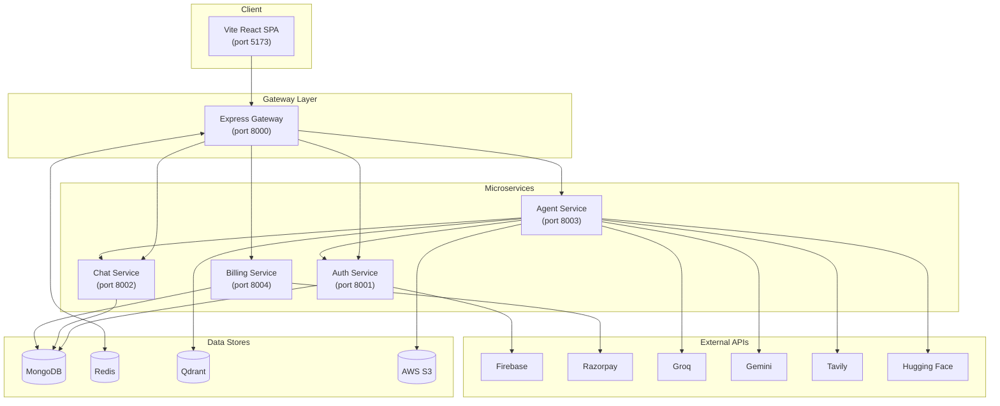
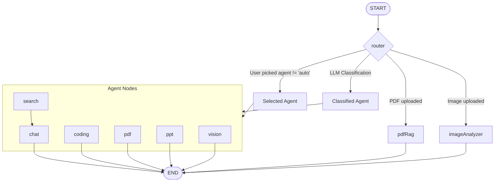
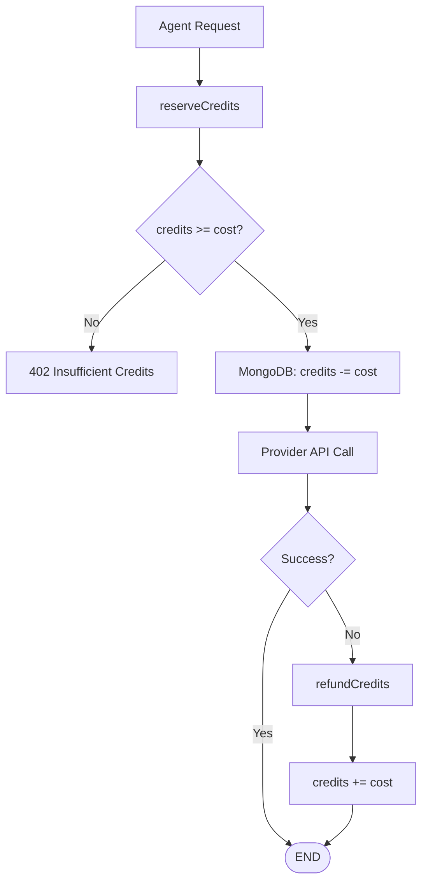
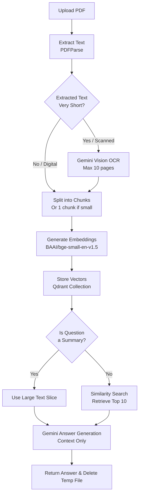
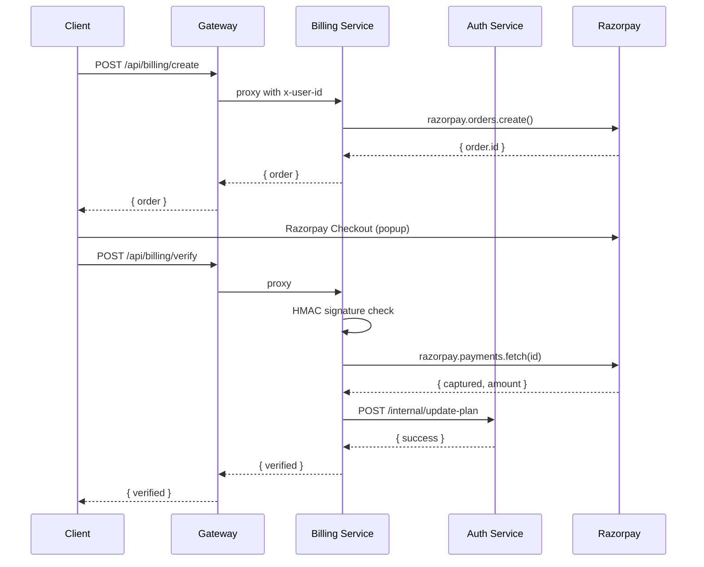

# CortexAI

> An AI-native productivity platform powered by a LangGraph multi-agent orchestrator, PDF RAG pipeline, and a credit-based billing engine.

**Chat · Research · Code · Documents · Slides · Images** — every request routed to a specialist agent.

---

## Stack

| Layer | Technology |
|-------|------------|
| **Frontend** | React 19 · Vite 8 · Redux Toolkit · Tailwind CSS v4 |
| **Orchestration** | LangGraph (`StateGraph`) · LangChain |
| **Agents** | OpenAI · Gemini 2.5 Flash · DeepSeek Chat · FLUX.1-schnell |
| **Vector DB** | Qdrant · HuggingFace Embeddings (`BAAI/bge-small-en-v1.5`) |
| **Databases** | MongoDB (Mongoose) · Redis (ioredis) |
| **Auth** | Firebase Admin · Session cookies |
| **Payments** | Razorpay (orders + HMAC verification) |
| **File Storage** | AWS S3 |
| **Search** | Tavily |

---

## Architecture



---

## Agent System

Eight specialist agents, orchestrated by a LangGraph `StateGraph`.



### Agents

| Agent | Model | Input | Output |
|-------|-------|-------|--------|
| **Chat** | DeepSeek (Groq) | Text | Markdown response |
| **Search** | DeepSeek (Groq) + Tavily | Text | Web results + images |
| **Coding** | Gemini 2.5 Flash | Text | Markdown + project artifacts |
| **PDF** | Gemini 2.5 Flash | Text | `.pdf` via PDFKit |
| **PPT** | Gemini 2.5 Flash + FLUX.1-schnell | Text | `.pptx` via PptxGenJS |
| **Vision** | FLUX.1-schnell (HuggingFace) | Text prompt | Generated image → S3 |
| **PDF RAG** | Gemini 2.5 Flash + Qdrant | Uploaded PDF | Answer from document |
| **Image Analyzer** | Gemini 2.5 Flash | Uploaded image | Analysis + OCR |

---

## Credit System

Credits are reserved **before** any provider call — a user at zero cannot get free work done.



- **Atomic debit**: MongoDB `findOneAndUpdate` with `credits >= cost` filter — no negative balance possible.
- **Exactly-once refund**: Reservation ID stored in Redis with 15-min TTL; auth claims it before crediting.
- **Price table** (`shared/config/agentCosts.js`): Single source of truth shared by billing and auth.

---

## PDF RAG Pipeline



---

## Payment Flow



---

## Project Structure

```
CortexAI/
├── backend/
│   ├── gateway/                     # API gateway — single public entry point
│   │   ├── controllers/user.controller.js   # /api/me handler
│   │   ├── middleware/auth.middleware.js    # Redis session cookie validation
│   │   └── utils/proxyWithHeader.js        # Service proxy with x-user-id injection
│   ├── services/
│   │   ├── auth/                     # Identity, sessions, credit ledger
│   │   │   ├── controllers/          # login, logout, reserveCredits, refundCredits, updateUserPayment
│   │   │   ├── models/user.model.js  # Mongoose schema: firebaseUid, plan, credits, totalCredits
│   │   │   └── routes/              # /login, /logout (public) + /internal/* (service-only)
│   │   ├── agent/                   # LangGraph orchestration + all AI agents
│   │   │   ├── agents/             # chat, search, coding, pdf, ppt, vision, pdfRag, imageAnalyzer
│   │   │   ├── config/             # llmModels, memory, agentLimit, multer, s3, tavily, vectorDb
│   │   │   ├── graph/              # StateGraph, router, agentState
│   │   │   └── utils/             # deductCredits, generatePdf, generatePpt, s3, getMessages
│   │   ├── billing/                # Razorpay integration
│   │   │   ├── controller/         # createOrder, verifyPayment
│   │   │   └── models/payment.model.js  # unique orderId + sparse paymentId
│   │   └── chat/                   # Conversation + message persistence
│   │       ├── controllers/         # createConversation, getConversations, saveMessage, getMessages
│   │       └── models/             # conversation (userId+updatedAt index), message (conversationId+createdAt index)
│   └── shared/
│       ├── auth/internalAuth.js    # requireUser, requireInternal, INTERNAL_HEADER, safeEqual
│       ├── config/plans.js         # PLANS, PURCHASABLE_PLAN_IDS (shared by billing + auth)
│       ├── config/agentCosts.js    # AGENT_COSTS (single source of truth)
│       ├── http/cookies.js        # parseCookies, readCookie (replaces missing cookie-parser)
│       └── redis/redis.js         # ioredis singleton + global error handler
├── frontend/
│   ├── src/
│   │   ├── components/
│   │   │   ├── ChatArea.jsx        # Conversation view + message fetch
│   │   │   ├── ChatInput.jsx       # Agent selector, voice input, file upload, send
│   │   │   ├── SideBar.jsx        # Conversation list, billing drawer trigger, logout
│   │   │   ├── MessageList.jsx     # Scroll-to-bottom, empty state, message rendering
│   │   │   ├── MessageBubble.jsx   # Markdown + code highlighting + image lightbox
│   │   │   ├── Artifact.jsx        # Monaco editor + sandboxed iframe preview
│   │   │   ├── BillingDrawer.jsx    # Plan selection + Razorpay checkout
│   │   │   ├── LoadingAnimation.jsx # Per-agent loading animations (motion/react)
│   │   │   └── Toast.jsx           # AnimatePresence toast notifications
│   │   ├── features/               # Redux Toolkit async thunks
│   │   │   ├── login.js, logOut.js, getCurrentUser.js
│   │   │   ├── getConversations.js, getMessages.js
│   │   │   ├── createConversation.js, updateConversation.js
│   │   │   ├── sendMessage.js
│   │   │   └── createOrder.js, verifyPayment.js
│   │   ├── redux/                 # userSlice, conversationSlice, messageSlice
│   │   ├── pages/Home.jsx, AuthPage.jsx
│   │   ├── contexts/ToastContext.jsx
│   │   └── hooks/useToast.js
│   └── utils/
│       ├── axios.js               # API client with credentials
│       ├── firebase.js             # Firebase app init + Google provider
│       └── authErrors.js          # Firebase → user-friendly error messages
```

---

## Environment Setup

### Backend — `backend/.env`

```env
# Gateway
PORT=8000
FRONTEND_URL=http://localhost:5173
INTERNAL_API_SECRET=<32+ char random string>

# Service URLs (for gateway proxy)
AUTH_SERVICE=http://localhost:8001
CHAT_SERVICE=http://localhost:8002
AGENT_SERVICE=http://localhost:8003
BILLING_SERVICE=http://localhost:8004

# Redis + MongoDB
REDIS_URL=redis://localhost:6379
MONGODB_URI=mongodb+srv://<user>:<pass>@<cluster>/cortexai

# Firebase (from service account key JSON)
FIREBASE_PROJECT_ID=cortex-ai-7ba05
FIREBASE_PRIVATE_KEY=<base64>
FIREBASE_CLIENT_EMAIL=<firebase-admin SDK email>

# LLM Providers
OPENAI_API_KEY=sk-...
HF_TOKEN=hf_...
TAVILY_API_KEY=tvly-...
GROQ_API_KEY=gsk_...
GOOGLE_GENAI_API_KEY=AIza...

# AWS S3
AWS_REGION=ap-south-1
AWS_ACCESS_KEY_ID=AKIA...
AWS_SECRET_KEY=...

# Vector DB
QDRANT_URL=http://localhost:6333

# Razorpay
RAZORPAY_KEY_ID=<key_id>
RAZORPAY_KEY_SECRET=<key_secret>
```

### Frontend — `frontend/.env`

```env
VITE_SERVER_URL=http://localhost:8000
VITE_FIREBASE_API_KEY=<firebase api key>
VITE_RAZORPAY_KEY_ID=<razorpay key id>
```

---

## Running Locally

```bash
# 1. Start Redis
docker compose -f backend/docker-compose.yml up -d redis

# 2. Backend services (each in its own terminal)
cd backend/gateway       && node index.js
cd backend/services/auth && node index.js
cd backend/services/chat && node index.js
cd backend/services/agent && node index.js
cd backend/services/billing && node index.js

# 3. Frontend
cd frontend && npm install && npm run dev
```

Open `http://localhost:5173` → Sign in with Google.

---

## Security Model

| Threat | Mitigation |
|--------|------------|
| Identity forgery | `x-user-id` written by gateway only; client-supplied headers stripped before proxy |
| Session fixation | New login invalidates previous Redis session; UUID v4 format check before lookup |
| Credit theft | Reservation debits before provider call; `credits >= cost` conditional update |
| Payment replay | `status: "created"` compare-and-swap in MongoDB; HMAC signature + capture check |
| Unauthenticated plan grant | Internal routes not proxied by gateway; require `x-internal-secret` |
| Path traversal (uploads) | Filenames are UUIDs; extension from allowlist mimetype only; resolved path checked against upload dir |
| Script injection in artifacts | DOMPurify sanitize + `<iframe sandbox="allow-scripts">` without `allow-same-origin` |
| SVG upload XSS | SVG mimetype rejected by `fileFilter`; only PNG/JPEG/WebP/GIF allowed |

---

## API Reference

### Auth

| Method | Path | Auth | Description |
|--------|------|------|-------------|
| `POST` | `/api/auth/login` | None | Verify Firebase ID token, issue session cookie |
| `POST` | `/api/auth/logout` | None | Clear session cookie + Redis keys |
| `GET` | `/api/me` | Session | Current user object |

### Chat

| Method | Path | Description |
|--------|------|-------------|
| `POST` | `/api/chat/create-conversation` | New conversation |
| `GET` | `/api/chat/get-conversations` | List (sorted by `updatedAt`) |
| `POST` | `/api/chat/update-conversation` | Rename (owner-scoped) |
| `POST` | `/api/chat/save-message` | Append message + artifacts |
| `GET` | `/api/chat/get-messages/:id` | Paginated messages |

### Agent

| Method | Path | Description |
|--------|------|-------------|
| `POST` | `/api/agent/chat` | `FormData`: `prompt`, `conversationId`, `agent`, `file?` |

### Billing

| Method | Path | Description |
|--------|------|-------------|
| `POST` | `/api/billing/create` | Create Razorpay order |
| `POST` | `/api/billing/verify` | Verify signature + capture + grant credits |
